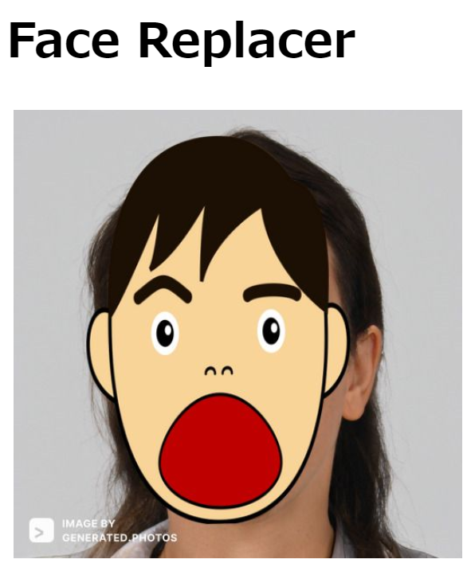

# Serverless Frameworkによるハンズオン

このリポジトリは下記の2つのハンズオンのためのリポジトリです。

* Serverless FremeworkによるデモアプリのX-Ray設定
* Serverless FrameworkによるサーバーレスなE2Eテストの実行

ディレクトリ構成は下記のとおりです。子プロジェクトはGit Submoduleで導入されており、それぞれ別のリポジトリで管理されています。
```plain
/                           親プロジェクト
├── face_replacer_e2e           E2Eテストの子プロジェクト
├── face_replacer_example       デモアプリの子プロジェクト
└── serverless-compose.yml      各プロジェクトの設定
```


## ハンズオン1 (X-Ray)

### AWSのX-Rayの有効化まで (先週のp4まで)

1. このリポジトリをクローンする (--recursive)
   ```bash
   git clone https://github.com/maskinoshita/face_replacer.git --recursive

   # --recursive 忘れた場合
   git clone https://github.com/maskinoshita/face_replacer.git
   git submodule update --init --recursive
   ```
2. ライブラリをインストールする
    ```bash
    cd face_replacer

    npm install                       # 親プロジェクト
    git submodule foreach npm install # 子プロジェクトすべて
    ```
3. `face_replacer_example/serverless.yml`の65行目の`suffix`を一意の値になるように編集
    https://github.com/maskinoshita/face_replacer_example/blob/59c7ea4c86aa257d107ca73490ff7be082b97b78/serverless.yml#L65
4. `face_replacer_example`をデプロイする
    ```bash
    # 子ディレクトリで実行してください (face_replacer_example)
    cd face_replacer_example
    sls deploy
    ```
5. `face_replacer/static/index.html`の18行目の`ITEM_LIST_API_URL`を下記で表示されるURLに変更する
    https://github.com/maskinoshita/face_replacer_example/blob/59c7ea4c86aa257d107ca73490ff7be082b97b78/static/index.html#L18
    ```bash
    sls info --verbose 2>/dev/null | grep HttpApiUrl | awk '{print $2 "/search"}'
    ```
6. 下記のコマンドで、静的Webサイトホスティングを有効にしたS3に編集したindex.htmlをアップロードする
    ```bash
    aws s3 sync static s3://$(sls info --verbose 2>/dev/null | grep ProcessedBucketName | awk '{print $2}')
    ```
7. ブラウザで下記のアドレスにアクセスして`Face Replacer`が表示されることを確認する
    ```bash
    sls info --verbose 2>/dev/null | grep StaticWebSiteUrl
    ```
8. AWSのS3のコンソールから適当な顔画像をOriginalBucketにアップロードする
    * サンプルの顔画像は下記のURLからダウンロードできます
        https://drive.google.com/file/d/1DJN-FoZyHpAUTMjWPFRlvnRtr3yPDAVp/view?usp=sharing
    * OriginalBucketの名前は下記で確認できます
        ```bash
        sls info --verbose 2>/dev/null | grep OriginalBucketName
        ```
9. 7.のURLに再度ブラウザでアクセスまたはページ更新をし、顔を隠した画像が表示されることを確認する



10. AWSのX-Rayのコンソールに行き、トレースとService Mapを確認する
    * Lambdaに関するトレースしか見えないことを確認する

### Lambdaから呼び出すAWSのサービスをトレースする

1. 完成済みのコードをmergeする
    ```bash
    git merge origin/p5
    ```
    変更箇所
    https://github.com/maskinoshita/face_replacer_example/compare/p4...p5
    * 主に`face_replacer_util.js`と`query.js`を参照。
2. ライブラリを更新する (aws-xray-sdkが追加されている)
    ```bash
    npm install
    ```
3. 変更済みのコードをデプロイ
    ```bash
    sls deploy
    ```
4. 再度、顔画像のアップロードとWebサイトの更新を実行する
5. AWSのX-Rayのコンソールに行き、トレースとService Mapを確認する
    * Lambdaから呼び出されるS3やDynamoDBなどがトレースやService Mapに表示されることを確認する

### APIGateway, Lambda内の関数をトレースする

1. 完成済みのコードをmergeする
    ```bash
    git merge origin/p6
    ```
    変更箇所
    https://github.com/maskinoshita/face_replacer_example/compare/p5...p6
    * API Gateway
        - Serverless.yml
            * httpApiはトレースをサポートしていないので、RestAPIに書き換える
            * corsの設定などが変わるので変更する
        - query.js
            * corsの設定が変わる。レスポンスヘッダーにcorsに関する設定を追加する。
    * Lambda
        - face_replacer.js
            * 計測したい範囲をSubsegment/Segmentとして定義する
2. 変更済みのコードをデプロイ
    ```bash
    sls deploy
    ```
3. APIGatewayの変更に伴い、APIのURLが変更されるので`static/index.html`を再修正し、アップロードする
    ```bash
    # Rest APIではServiceEndpointとなるので注意
    sls info --verbose 2>/dev/null | grep ServiceEndpoint | awk '{print $2 "/search"}'

    # static/index.htmlを編集

    # 再度index.htmlをアップロード
    aws s3 sync static s3://$(sls info --verbose 2>/dev/null | grep ProcessedBucketName | awk '{print $2}')
    ```
3. 再度、顔画像のアップロードとWebサイトの更新を実行する
4. AWSのX-Rayのコンソールに行き、トレースとService Mapを確認する
    * APIGatewayやLambda内の関数がトレースに表示されることを確認する

## ハンズオン2 (E2Eテスト)

1. `face_replacer_e2e/serverless.yml`の76行目の`suffix`を一意の名前に変更する
    https://github.com/maskinoshita/face_replacer_e2e/blob/afde125e2ed045ca6a4e1724d2fdc1b851b30d0b/serverless.yml#L76
2. `face_replacer_e2e/serverless.yml`の78行目の`layersDeploymentBucket`に相当するS3 Bucketを手動で作成する (Lambdaレイヤーの保存場所)
    https://github.com/maskinoshita/face_replacer_e2e/blob/afde125e2ed045ca6a4e1724d2fdc1b851b30d0b/serverless.yml#L78
    ```bash
    aws s3 mb s3://20220527-layers-bucket-XXXXXXXXXX
    ```
3. 親ディレクトリ`face_replacer`でデプロイをする(face_replacer_e2eはface_replacer_exampleに依存するので、親ディレクトリで実施してください)
    ```bash
    cd ..
    sls deploy
    ```
4. コードを確認する
    * serverless-step-functionsプラグインを使った`serverless.yml`内でのStepFunctionsの定義を行っています。
        https://github.com/maskinoshita/face_replacer_e2e/blob/afde125e2ed045ca6a4e1724d2fdc1b851b30d0b/serverless.yml#L108-L130
    * `init.js`
        E2Eテスト用にS3Bucket, DynamoDBのデータをクリーンにします
    * `s3put.js`
        テスト用に`face_images/male1.jpg`をOriginalBucketにPutします
    * `e2e.js`
        E2Eテスト用のLambda。このファイルはJestの設定をなどを行います。実際のテストは、`e2e.test.js`で行います。
    * `e2e.test.js`
        JestおよびPuppeteerを使ったE2Eのテストを実施します。確証としてスクリーンショットをテスト用のバケットに保存します。
5. E2Eテストを実際に動作させてみる
    ```bash
    # 親ディレクトリにいる場合
    sls face-replacer-e2e:invoke stepf --name E2ETestStateMachine

    # 子ディレクトリの場合
    cd face_replacer_e2e
    sls invoke stepf --name E2ETestStateMachine
    ```
6. 結果を確認してみる
    * StepFunctions
    * テスト用のS3バケットのスクリーンショット

## クリーンアップ

1. AWSのS3コンソールで下記のバケットを空にする
    - `face_replacer_example`
        - OriginalBucket
        - ProcessedBucket
    - `face_replacer_e2e`
        - TestArtifactsBucket
        - layersDeploymentBucket (手動で作成したので、削除まで実施する)
2. 親ディレクトリで下記を実施
    ```bash
    sls remove
    ```